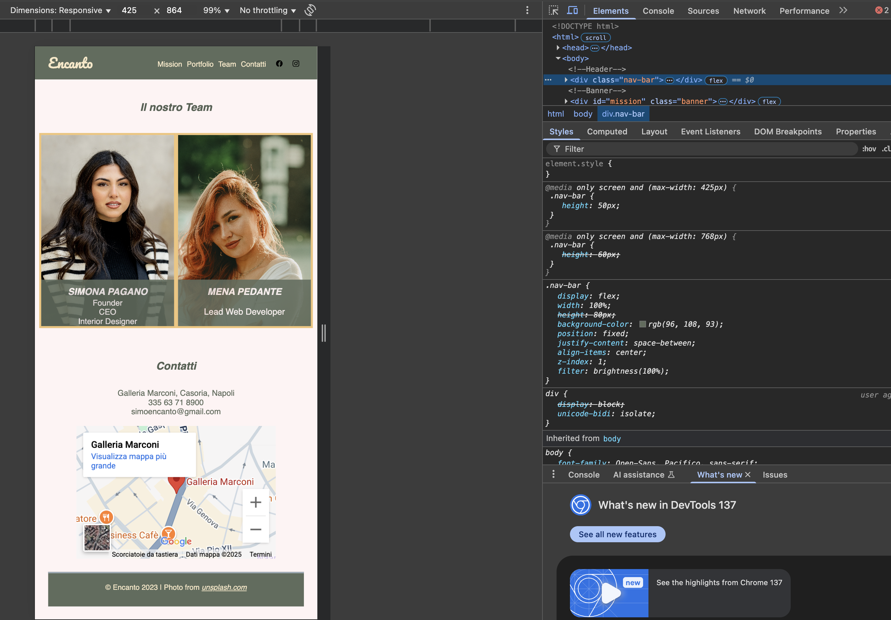

# Interior Design Website

This project was created for a friend starting her career in interior design. It is a **static website** built with HTML and CSS, aiming to provide a clean and elegant layout to showcase her work.

## Project Overview

The website includes:

-   **One HTML file**, structured with `div` elements and semantic sections. It also features an embedded **Google Maps link** for location access.

-   **One CSS file** that defines the visual style, layout, and responsiveness of the site.

-   **A resources folder** containing the images and assets used for the design.

## Responsive Design

The layout is fully responsive and adapts to **mobile** and **desktop** screen sizes. Screenshots of both views are included below.

## Screenshots

---

Feel free to explore the code. Feedback and suggestions are always welcome!
